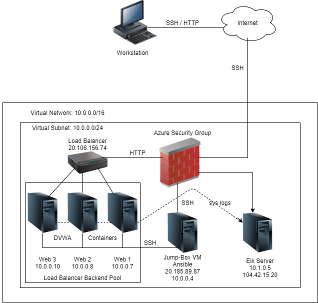
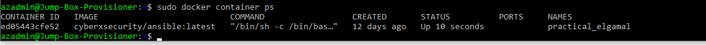

# Project1
Cybersecurity Bootcamp Project #1

## Automated ELK Stack Deployment

The files in this repository were used to configure the network depicted below.

These files have been tested and used to generate a live ELK deployment on Azure. They can be used to recreate the entire deployment pictured above.

[Ansible Elk Playbook](https://github.com/kryshael/Project1/blob/main/Assets/YmlScripts/Elk.yml)

This document contains the following details:
- Description of the Topology
- Access Policies
- ELK Configuration
  - Beats in Use
  - Machines Being Monitored
- How to Use the Ansible Build

### Description of the Topology

The main purpose of this network is to expose a load-balanced and monitored instance of DVWA, the D*mn Vulnerable Web Application.

Load balancing ensures that the application will be highly available, in addition to restricting traffic to the network.
Load balancers protects the system from DDoS attacks by shifting attack traffic.
The advantage of a jump box is to give access to the user from a single node that can be secured and monitored.

Integrating an ELK server allows users to easily monitor the vulnerable VMs for changes to the data and system logs.

Filebeat watches for any information in the file system which has been changed and when it has.
Metricbeat takes the metrics and statistics that you collects and displays in a format of your choosing.

The configuration details of each machine may be found below.

|   Name  |  Function  | IP Address |   OS  | Container Type |
|:-------:|:----------:|:----------:|:-----:|:--------------:|
| Jumpbox |   Gateway  |  10.0.0.4  | Linux |     Ansible    |
|  Web 1  | Web Server |  10.0.0.7  | Linux |      DVWA      |
|  Web 2  | Web Server |  10.0.0.8  | Linux |      DVWA      |
|  Web 3  | Web Server |  10.0.0.10 | Linux |      DVWA      |
|   Elk   | Elk Server |  10.1.0.5  | Linux |     Elk:761    |

### Access Policies

The machines on the internal network are not exposed to the public Internet. 

Only the Jumpbox machine can accept connections from the Internet. Access to this machine is only allowed from my home IP address.

Machines within the network can only be accessed by the Jumpbox via SSH on Port 22. The Elk machine can only be accessed by the Jumpbox.

A summary of the access policies in place can be found in the table below.

|   Name  | Publicly Accessible? | Allowed IP Addresses |
|:-------:|:--------------------:|:--------------------:|
| Jumpbox |          No          |    SSH via Port 22   |
|  Web 1  |          Yes         |      Via Port 80     |
|  Web 2  |          Yes         |      Via Port 80     |
|  Web 3  |          Yes         |      Via Port 80     |
|   Elk   |          No          |   SSH via Port 5601  |

### Elk Configuration

Ansible was used to automate configuration of the ELK machine. No configuration was performed manually, which is advantageous because it reduces the possibility of mistakes when writing and updating the code. One file to many machines.

The [Ansible Elk Playbook](https://github.com/kryshael/Project1/blob/main/Assets/YmlScripts/Elk.yml) implements the following tasks:

 - Changes a `systemctl` file to allow the container to access more memory. 
 - Installs Docker.io
 - Installs Python3 Pip
 - Installs Pip Docker Module
 - Installs the Elk Container to Listen on a series of Ports and ensure that it starts up with Docker Service
 - Ensures Docker Service Starts on Boot

The following screenshot displays the result of running `docker ps` after successfully configuring the ELK instance.

### Target Machines & Beats
This ELK server is configured to monitor the following machines:

 - 10.0.0.7
 - 10.0.0.8
 - 10.0.0.10

We have installed the following Beats on these machines:

 - Filebeat
 - Metricbeat

These Beats allow us to collect the following information from each machine:

Filebeat is a lightweight shipper for forwarding and centralizing log data. Installed as an agent on your servers, Filebeat monitors the log files or locations that you specify, collects log events, and forwards them either to Elasticsearch or Logstash for indexing.

Metricbeat is a lightweight shipper that you can install on your servers to periodically collect metrics from the operating system and from services running on the server. Metricbeat takes the metrics and statistics that it collects and ships them to the output that you specify, such as Elasticsearch or Logstash.

### Using the Playbook
In order to use the playbook, you will need to have an Ansible control node already configured. Assuming you have such a control node provisioned: 

SSH into the control node and follow the steps below:
- Copy the elk.yml file to /etc/ansible
- Update the hosts file to include the IP address of the ELK server ( 10.1.0.5 )
- Run the playbook **andible-playbook elk.yml** and use a web browser along with your Elk servers' public IP address to veryify that the installation was a success.
**https://xxx.xx.xx.xx/app/kibana**

_TODO: Answer the following questions to fill in the blanks:_
- _Which file is the playbook? Where do you copy it?_
- _Which file do you update to make Ansible run the playbook on a specific machine? How do I specify which machine to install the ELK server on versus which to install Filebeat on?_
- _Which URL do you navigate to in order to check that the ELK server is running?

_As a **Bonus**, provide the specific commands the user will need to run to download the playbook, update the files, etc._
